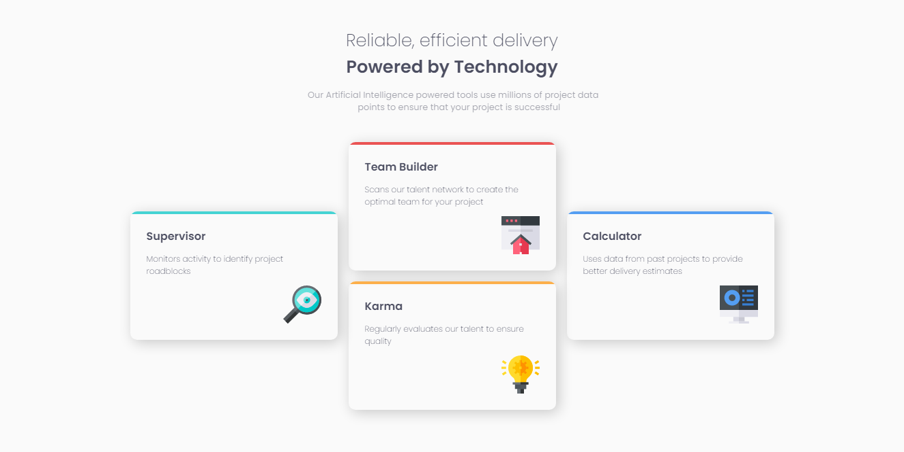

# Frontend Mentor - Four card feature section solution

This is a solution to the [Four card feature section challenge on Frontend Mentor](https://www.frontendmentor.io/challenges/four-card-feature-section-weK1eFYK). Frontend Mentor challenges help you improve your coding skills by building realistic projects. 

## Table of contents

- [Overview](#overview)
  - [The challenge](#the-challenge)
  - [Screenshot](#screenshot)
  - [Links](#links)
- [My process](#my-process)
  - [Built with](#built-with)
  - [What I learned](#what-i-learned)
  - [Continued development](#continued-development)
  - [Useful resources](#useful-resources)
- [Author](#author)

## Overview

### The challenge

Users should be able to:

- View the optimal layout for the site depending on their device's screen size

### Screenshot

### Links

- #### [Solution](https://your-solution-url.com)
- #### [Live Site](https://your-live-site-url.com)

## My process

### Built with

- Semantic HTML5 markup
- CSS custom properties
- Flexbox
- CSS Grid
- Mobile-first workflow

### What I learned

This challenge was a great learning opportunity, it was also very useful to reinforce previous knowledge, and face problems that had not been presented to me before.

## Author

- Instagram - [@cosmo_art0](https://www.instagram.com/cosmo_art0/)
- Frontend Mentor - [@CosmoArt](https://www.frontendmentor.io/profile/CosmoArt)
- Twitter - [@CosmoArt0](https://twitter.com/CosmoArt0)